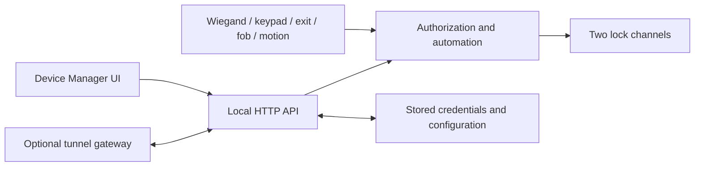

# Access Controller

ESP32-S3 firmware, web controls and hardware for a two-channel strike/magnetic
lock controller. Wiegand readers, keypads, exit buttons, fobs and motion inputs
feed the same authorization and lock-control services.

## Project map

| Area | Purpose |
|---|---|
| [Active firmware](code/controller/README.md) | ESP32-S3 controller and embedded Device Manager UI |
| [Documentation](docs/README.md) | Architecture, hardware, provisioning and operating workflows |
| [Tests](code/controller/tests/README.md) | Offline checks and separately invoked device tests |
| [Tunnel server](code/tunnel/README.md) | Optional remote access to the device UI |
| [Controller mini](code/controller_mini/README.md) | Alternate experimental firmware |
| `circuits/controller`, `circuits/strike` | KiCad designs and manufacturing artifacts |
| `model`, `images` | Enclosures, mechanical sources and board views |
| [Consolidation audit](docs/WORKSPACE_CLEANUP.md) | Branch disposition, recovery and current verification |



## Build and check

Use the configured ESP-IDF checkout and `esp_websocket_client` component.
The current firmware targets **ESP32-S3**; building does not flash a controller.

```sh
source ~/esp/esp-idf/export.sh
idf.py -C code/controller build
cd code/controller/tests
npm ci
npm run test:wiegand-format
npm run test:boot-audio
CHROMIUM_PATH=/usr/bin/google-chrome npm run test:ui-network
```

The browser check uses intercepted fixtures and cannot operate a real lock.
It covers desktop/mobile navigation, AP/STA links and recovery after saving
Wi-Fi settings. Omit `CHROMIUM_PATH` to use Playwright's installed Chromium.

| Next task | Guide |
|---|---|
| Provision AP, LAN or tunnel access | [Network provisioning](docs/NETWORK_PROVISIONING.md) |
| Flash or run attached-device tests | [Deploy and test runbook](docs/CONTROLLER_DEPLOY_AND_TEST.md) |
| Change firmware or hardware | [Workflows](docs/WORKFLOWS.md) |

The repository retains its established **`master`** default branch. Legacy
Python 2/lws-factory setup instructions are available in Git history; use the
current ESP-IDF workflow above for this firmware.
