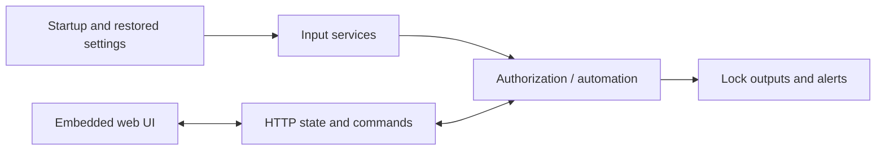

# ESP32-S3 Access Controller Firmware

This is the active two-channel controller application. Its local HTTP server
embeds the Device Manager web assets and can also be reached through the tunnel
service. [Project documentation](../../docs/README.md).

## Source map

| Path | Responsibility |
|---|---|
| `main/main.c` | Startup, device identity and network recovery |
| `main/services/` | Lock/input services, authorization, storage, APIs and tunnel |
| `main/public/` | Embedded HTML, JavaScript, CSS and matching gzip assets |
| `tests/` | Native/source checks and browser/device suites |
| `CMakeLists.txt` | ESP-IDF project and local WebSocket component location |



## Reproduce the build

From the repository root:

```sh
source ~/esp/esp-idf/export.sh
idf.py -C code/controller build
```

The configured target is ESP32-S3 with 16 MB flash. The WebSocket component
path is currently machine-specific; check `CMakeLists.txt` when using another
checkout. Keep each `.gz` asset synchronized with its plain source.

## Choose the verification scope

| Scope | Command from `tests/` | Effect |
|---|---|---|
| Native Wiegand decoder | `npm run test:wiegand-format` | Host-only C test |
| Startup and quiet-mode contracts | `npm run test:boot-audio` | Source checks |
| Wi-Fi/IP-link UI | `npm run test:ui-network` | Intercepted browser fixtures only |
| Device/API/UI suite | `npm test` | Connects to a controller and changes its state |
| Physical walkthrough | `npm run test:physical` | Attached-hardware interaction |

See [test setup](tests/README.md) and the [deployment runbook](../../docs/CONTROLLER_DEPLOY_AND_TEST.md)
for device operations. The consolidation verification used host checks and
browser fixtures; no lock was operated or firmware flashed.
