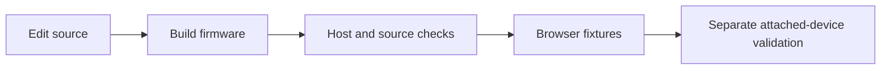

# Workflows

## Build the Active Controller Firmware

From the active firmware directory:

```bash
cd code/controller
source ~/esp/esp-idf/export.sh
idf.py build
```

The project expects ESP-IDF and a local `esp_websocket_client` component path
configured in `code/controller/CMakeLists.txt`.

## Flash the Active Controller Firmware

Interactive helper:

```bash
cd code/controller
./flash_esp32s3.sh
```

Direct flasher that waits for manual download mode:

```bash
cd code/controller
./flash_now.sh
```

Manual ESP32-S3 download mode sequence documented by the project:

1. Hold `BOOT`.
2. Press and release `RESET`.
3. Release `BOOT`.
4. Start flashing.

Manual command:

```bash
cd code/controller
source ~/esp/esp-idf/export.sh
idf.py -p /dev/ttyUSB0 flash monitor
```

## Use the Local Device UI

The device UI is served by the ESP32 firmware.

Common URLs:

- AP fallback default: `http://192.168.4.1/`
- Station mode: use the IP printed by the device or discovered on the LAN.
- Tunnel mode: `http://<tunnel-host>:9000/device/<device-id>/`

The embedded UI source lives in:

```text
code/controller/main/public/
```

## Offline checks before device testing



From `code/controller/tests`, run `npm run test:wiegand-format`,
`npm run test:boot-audio` and `npm run test:ui-network`. The last command
uses mocked HTTP responses; it does not send controller commands.

## Run Controller Tests

Install once:

```bash
cd code/controller/tests
npm install
npx playwright install chromium
```

Run tests:

```bash
DEVICE_URL=http://192.168.4.1 npm run test:quick
DEVICE_URL=http://192.168.4.1 npm run test:api
DEVICE_URL=http://192.168.4.1 npm run test:ui
DEVICE_URL=http://192.168.4.1 npm run test:stress
DEVICE_URL=http://192.168.4.1 npm run test:physical
```

`npm run test:physical` is interactive and requires real hardware actions.

## Complete Deploy and Recovery Validation

Use `docs/CONTROLLER_DEPLOY_AND_TEST.md` for the end-to-end deploy loop:

- ESP32-S3 serial programming and OTA deploy.
- First-boot AP validation at `http://192.168.4.1/`.
- Provisioning to Wi-Fi and switching between saved networks such as `Echo42`
  and `HelloWorld`.
- AP fallback/recovery when the active Wi-Fi disappears.
- Device Manager checks through `http://192.168.1.40:8102/`.
- Public `https://open-automation.org/devices` punch/auth checks.
- Direct and Device Manager OTA validation.
- Full `npm test` and Playwright desktop/mobile UI smoke.

## Run the Tunnel Locally

Install dependencies:

```bash
cd code/tunnel
npm install
```

Create `.env` from the example:

```bash
cp env.example .env
```

Run server:

```bash
npm run start
```

Run a mock ESP32 client in another shell:

```bash
DEVICE_ID=my-test-device npm run mock-client
```

Open or curl through the tunnel:

```bash
curl http://127.0.0.1:9000/device/my-test-device/
```

## Run the Tunnel with Docker Compose

```bash
cd code/tunnel
cp env.example .env
docker compose up --build -d
docker compose logs -f
```

Stop:

```bash
docker compose down
```

## Deploy the Tunnel as a Service

The project includes Ubuntu systemd helpers:

```bash
cd code/tunnel
./scripts/install-service.sh
sudo journalctl -u esp32-tunnel -f
```

Remove:

```bash
cd code/tunnel
./scripts/uninstall-service.sh
```

The installer syncs the tunnel into `/opt/esp32-tunnel`, creates an
`esp32-tunnel` user, installs production dependencies, seeds `.env`, and enables
the service.

## Populate Tunnel-Hosted UI Assets

The tunnel can serve static UI files directly to avoid pulling large UI assets
through the ESP32 tunnel.

```bash
cd code/tunnel
cp -v ../controller/main/public/index.html ./device-ui/index.html
cp -v ../controller/main/public/style.css ./device-ui/style.css
cp -v ../controller/main/public/script.js ./device-ui/script.js
```

## Work on Hardware

Main controller:

```bash
cd circuits/controller
```

Open `access-controller.kicad_pro` in KiCad. The top-level schematic is
`access-controller.kicad_sch`; the board is `access-controller.kicad_pcb`.

Strike controller:

```bash
cd circuits/strike
```

Open `strike-controller.kicad_pro`.

Manufacturing outputs are already generated under each board's `Manufacturer`
folder. Regenerate BOM, placement, gerbers, and drills from KiCad after any PCB
or schematic change.

## Work on Enclosures

Current controller enclosure source and exports are in:

```text
model/controller/
```

Use the `.blend` files as source, `.stl`/`.3mf` as mesh/slicer artifacts, and
`.gcode` as printer-specific output. Regenerate printer-specific G-code after
changing machine, filament, slicer profile, or model geometry.

## Documentation Maintenance

When source or hardware changes, update:

- `docs/PROJECT.md` for architectural/device behavior changes.
- `docs/REPOSITORY_MAP.md` for folder/file organization changes.
- `docs/SOFTWARE.md` for firmware, API, UI, tunnel, or test changes.
- `docs/HARDWARE.md` for KiCad, manufacturing, connector, or model changes.
- `docs/POWER_AND_ENERGY_HARVESTING.md` when battery, power-save, or
  energy-harvesting design decisions change.
- `docs/WORKFLOWS.md` for build, flash, test, deployment, or hardware workflow
  changes.
- `docs/PLAN.md` when modernization tasks change state.
