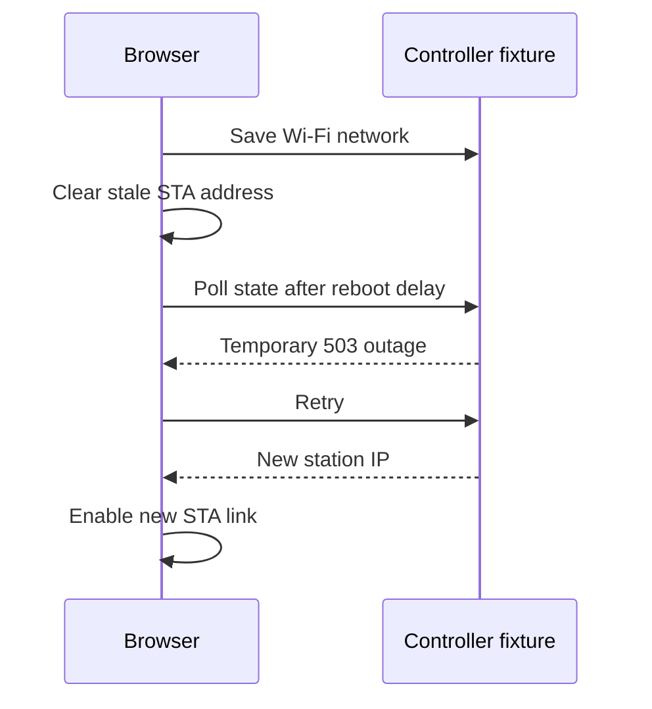

# Workspace consolidation — 2026-09-26

`access-controller` is the canonical checkout. Its established default branch
remains `master`, preserving firmware and deployment workflows.

## Source and ref decisions

| Original item | Result |
|---|---|
| `master` / `origin/master` at `0d0e3cd` | Fetched; no incoming changes |
| Saved embedded UI edits | Retained clickable AP/STA links and Wi-Fi handoff polling |
| Saved live browser suite changes | Retained; syntax checked, not run against a controller |
| `codex/wiegand-input-bias` at `6146a7b` | Already an ancestor of `master`; obsolete local branch removed |
| `origin/init` at `18eecb1` | One 2019 README-only commit; preserved with a history merge retaining the modern README, then obsolete remote branch removed |
| Tracked clangd cache deletions | Retained; `.cache/` now ignored |
| Dependency lockfile | Current component manager normalizes schema/local paths; dependency versions unchanged |
| Stashes / extra worktrees | None |

The old `init` README describes the earlier Python 2 / lws-factory workflow.
It adds no implementation beyond current `master`. The modern firmware guide
replaces that text while Git history and the recovery bundle retain it.

## Behavior and tests



| Check | Result |
|---|---|
| Fresh ESP-IDF build | Passed, 1,086 tasks; ESP32-S3 / 16 MB; binary `0x17bf60`, 26% application partition free |
| Wiegand formatting | Native regression passed |
| Boot audio regression | Passed after aligning the existing test with supported exit-input inversion |
| Offline Playwright network flow | Desktop/mobile tabs, Wi-Fi save, stale-IP clearing, simulated outage, new IP link and navigation passed |
| Browser errors | None beyond the deliberately injected 503 |
| UI and live-suite JavaScript | Syntax checks passed |
| Embedded compressed assets | All three gzip files exactly match their sources |

The firmware build retains existing unused-code and SDK warnings. No lock was
operated, no controller was flashed, and the attached-device suite was not
run. Physical Wi-Fi recovery, OTA and lock operation need a separate device
validation session.

## Reproduce the offline verification

From the repository root:

```bash
source /home/andy/esp/esp-idf/export.sh
idf.py -C code/controller -B /tmp/access-controller-clean-build build
cd code/controller/tests
npm ci
npx playwright install chromium
npm run test:wiegand-format
npm run test:boot-audio
npm run test:ui-network
```

`CHROMIUM_PATH=/usr/bin/google-chrome` selects an installed Chrome for the
offline browser test. `ARTIFACT_DIR` selects a screenshot directory. The
default `npm test` targets an attached device; it is not an offline test.

## Recovery

The original state and verification evidence are private local files under:

```text
.git/repo-cleanup/20260926T134208Z/
```

| File | Contents |
|---|---|
| `manifest.json`, `VERIFIED` | Original status, refs, worktrees and snapshot verification |
| `git.tar.zst` | Original Git database and refs |
| `worktree.tar.zst`, `tracked.patch` | Original local source and edits |
| `refs-before-cleanup.bundle` | Verified portable pre-prune history |
| `build.log` | Fresh compiler output |
| `boot-audio.log`, `ui-network.log`, `ui/` | Regression evidence and inspected screenshots |

Restore archives into a separate directory before selectively recovering a
file. This evidence is not part of the firmware or tracked repository.
